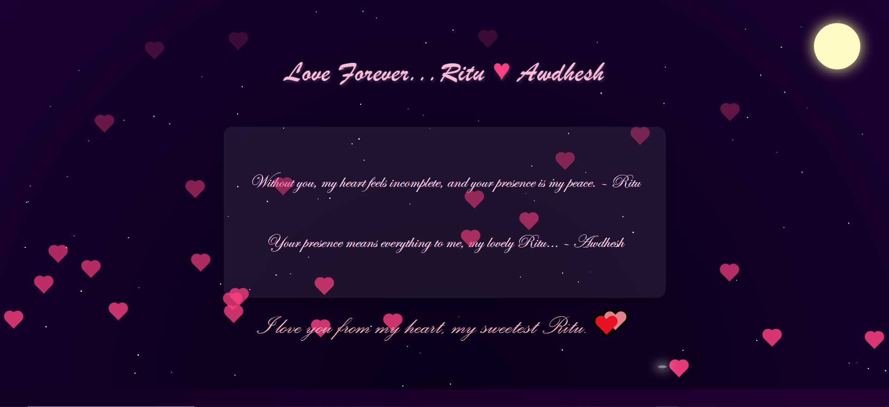

## ❤️ Love Forever – A Heartfelt Digital Expression of Endless Love

I’m so happy to share my special frontend experiment — a heartfelt digital love letter crafted entirely for *Ritu and Awdhesh*, designed and developed with pure **HTML + CSS + JavaScript**.

This heartfelt creation softly weaves endless love into pure lines of HTML, gentle layers of CSS, and delicate touches of JavaScript.
Each tiny animation — from twinkling stars to floating hearts — whispers feelings that words alone could never hold.
Together, they create a living promise that true love — the love of Ritu and Awdhesh — shines, drifts, rises, and stays forever.

This isn’t just code — it’s a gentle love story written under a dreamy night sky with twinkling stars, floating hearts, a glowing moon, and a falling star — a soft reminder that true love is endless, just like the sky that always holds them close.

---

## 🌙 About the Project

This project is a creative experiment to turn simple frontend code into a poetic expression of endless love.  
It blends a peaceful night sky with a glowing moon, drifting hearts, and a soft love letter — everything coded by hand to feel personal and warm.

---

## ✨ What Makes This Digital Letter Unique

Every element in this project is crafted to convey emotion and softness.  
From a flickering star to a floating pink heart, each piece says: true love lives in tiny details.

- 🌙 A calm, deep radial gradient background that feels like an infinite night sky  
- 🌕 A pale-yellow glowing moon softly fixed at the top corner  
- ✨ 100 tiny twinkling stars randomly placed and gently flickering  
- ☄️ A falling star gliding down again and again, like a wish in motion  
- 💖 30 floating hearts, crafted purely with CSS, drifting upward endlessly  
- ❤️ Heartbeat animation on the ‘Love Forever…’ title, adding life to the words  
- 📜 A soft pink love letter box in the center with handwritten lines  
- 🕊️ A floating message that rises from the bottom again and again  
- 🟣 A subtle bottom strip tying the entire visual together

---

## 🌟 Main Creative Elements – In Detail

---

### 1️⃣ Background – Night Sky with Radial Gradient

The deep, blended gradient background sets the mood like a peaceful night sky.  
It reminds us that true love is endless, calm, and always present.

---

### 2️⃣ Moon – Peace & Presence

The glowing moon, softly shining in the top corner, stands for steady presence — a gentle promise that real love is always there, no matter how far.

---

### 3️⃣ Twinkling Stars – Hopes & Memories

Tiny flickering stars scatter across the sky to capture memories, secret wishes, and silent promises that light up love’s journey.

---

### 4️⃣ Falling Star – A Dream Moving

The falling star drifts again and again, like a wish that keeps travelling — a symbol that dreams in true love never fall away, they keep moving.

---

### 5️⃣ Floating Hearts – Endless Affection

The hearts floating upward show that real affection always rises.  
Each heart, coded with pure CSS, drifts softly to remind us that love never stays still — it keeps growing.

---

### 6️⃣ Heartbeat Text – Words that Breathe

The heartbeat animation on the title ‘Love Forever…’ makes the words come alive — just like a heart that beats for someone special every moment.

---

### 7️⃣ Love Letter Box – Words of Emotion

In the center, a soft pink box holds handwritten lines.  
These lines are simple, raw expressions of love that feel warm and personal.

> “Without you, my heart feels incomplete, your presence is my peace.” 
> – Ritu

> “Your presence means everything to me, my lovely Ritu…” 
> – Awadhesh

---

### 8️⃣ Floating Message – A Promise Rising

At the bottom, a gentle floating message keeps rising.  
It’s like a promise that true love lifts higher than any words.

---

### 9️⃣ Bottom Strip – Ties It Together

The thin strip at the bottom grounds the entire scene, like a final line that gently connects every floating feeling.

---

## 🔧 Key Highlights

This project shows how much emotion you can weave into simple frontend code.  
Each tiny effect is done with pure CSS animations and a bit of JavaScript — no big frameworks, only thoughtful details.

✅ Radial Gradient Background — endless sky effect  
🌕 Glowing Moon — absolute positioned with a soft glow  
✨ Twinkling Stars — opacity animations for gentle flicker  
☄️ Falling Star — smooth glide + glow  
💖 Floating Hearts — pure CSS shape, unique speeds  
❤️ Heartbeat Title — main heading pulsing softly  
📜 Love Letter Box — glassy center block with heartfelt words  
🕊️ Floating Message — sweet promise rising again and again  
🟣 Bottom Strip — balances the entire scene

---

## 🧠 Skills Demonstrated

This small project proves how simple code can tell deep stories.  
It covers motion, layering, positioning, and creative animation — all done from scratch.

▪️ HTML structure + CSS styling  
▪️ CSS Animations, Keyframes, Transforms  
▪️ Creative Positioning, layering, and Z-index  
▪️ Cursive handwritten font styling for an emotional feel  
▪️ Using minimal JavaScript only to create dynamic random stars & hearts  
▪️ Pure frontend motion design and emotion-based micro-interaction

---

## 📂 Use Cases

You can use this concept in your own creative web projects too.  
It works as a portfolio piece, digital greeting card, or just a practice for pure frontend magic.

▪️ Creative coding for frontend portfolios  
▪️ Practice for CSS animations & transforms  
▪️ Digital greeting card or love letter inspiration  
▪️ Personal website micro-interaction or Easter egg  
▪️ Learning how to blend design + motion without big frameworks

---

## 📸 Project Preview

🖼️ **Love Forever – Digital Love Letter**  
(*Visual: Radial Gradient Sky, Glowing Moon, Twinkling Stars, Falling Star, Floating Hearts, Heartbeat Title, Love Letter Box*)

## 📸 Extra Project Preview

🖼️ **Alternate Visual – Love Forever**  
(*A different angle showing the same dreamy love letter*)

---

## 💖 Conclusion

This tiny page is a reminder that sometimes simple code can say what plain words cannot.  
From the endless sky to the drifting hearts — it softly promises: true love stays forever.

---
